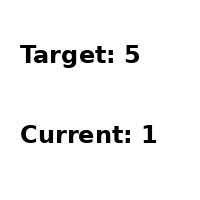
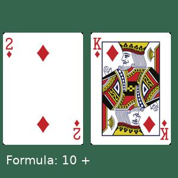
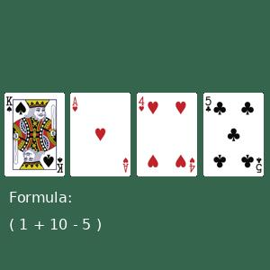
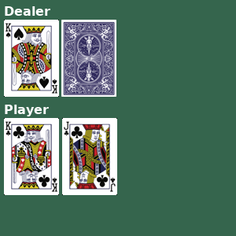

# Visual Card Games at Gym

<p align="center">
  
  
  
  
</p>

A Custom Gym Environment containing these four games: Numberline, EZPoints, Points24, and Blackjack.

Given pixel-based observation of game state, the agent need to write the solution by typing unit by unit.

## Install

This env is based on **gymnasium**.

Use

```
cd gym-cards
pip install -e .
```

## Usage

We provide a simple usage example below, also see a more detailed usage [here](./play_gymcards.ipynb).
```
import gym_cards
import gymnasium as gym
# numberline
env = gym.make('gym_cards/NumberLine-v0')
# EZPoints
env = gym.make('gym_cards/EZPoints-v0')
# 24game
env = gym.make('gym_cards/Points24-v0')
# blackjack game
env = gym.make('gym_cards/Blackjack-v0')
```

Blackjack also has a symbolic version, which is the same as the original gymnasium version.
```
env = gym.make('gym_cards/Blackjack-v0', is_pixel=False)
```

Then you can use the env as a normal gym env.

```
obs, info = env.reset()
op = 1
obs, reward, terminated, truncated, info = env.step(op)
```

## Doc

### NumberLine-v0

The Number Line Environment is a custom Gym environment that simulates a simple number line. It is designed for easy debugging.

**Actions**
The environment accepts two discrete actions:
- `0`: Move left (decrease the current position by 1, if greater than 0).
- `1`: Move right (increase the current position by 1, if less than `max_position`).

**Observation Space**
The observation is an RGB image with the following characteristics:
- Shape: (200, 200, 3)
- Pixel values range from 0 to 255.
- The image displays the current and goal positions on the number line.

**Termination**
An episode ends when the current position reaches the goal position.

**Reward**
- `1`: If the current position is the same as the goal position.
- `-1`: is given if the action does not move the current position closer to the goal position.
- `0`: Otherwise.

**Initialization Options**
- `max_position` (default: 5): Sets the maximum value on the number line. Both the start and goal positions are randomly initialized between 0 and `max_position`.

**Notes**
- The start and goal positions are randomized at the beginning of each episode.
- If after 2 * max_position steps the target still is not meet, the episode is terminated and the environment is reset.
- The environment ensures that the start and goal positions are not initially the same.
- Observations are returned as RGB images with the current and goal positions clearly labeled.

### EZPoints-v0


**Actions**

- **0-9**: Represent numbers 1-10
- **10-12**: Operators and control actions: '+', '\*', '='

**Observations**

A numpy uint8 array of shape (300,300,3).

**Termination**

- If an invalid action is taken.
- If the formula length exceeds 5.
- If '=' action is taken, the formula is evaluated.

**Reward**

- **10**: If the formula evaluates to the target_points.
- **-1**: if an invalid action is taken or the result isn't correct.
- **0**: Otherwise.


### Points24-v0


**Initialization Options**

- `treat_face_cards_as_10`: Treats face cards J, Q, K as 10 (default is True).
- `target_points`: The target sum to reach (default is 24).

**Actions**

- When `treat_face_cards_as_10=True`:

  - **0-9**: Represent numbers 1-10
  - **10-16**: Operators and control actions: '+', '-', '\*', '/', '(', ')', '='

- When `treat_face_cards_as_10=False`:
  - **0-12**: Represent numbers 1-13
  - **13-19**: Operators and control actions: '+', '-', '\*', '/', '(', ')', '='

**Observations**

A numpy uint8 array of shape (300,300,3).

**Termination**

- If an invalid action is taken.
- If the formula length exceeds 20.
- If '=' action is taken, the formula is evaluated.

**Reward**

- **10**: If the formula evaluates to the target_points.
- **-1**: if an invalid action is taken or the result isn't correct.
- **0**: Otherwise.

### Blackjack-v0

Please refer to gymnasium's Blackjack implementation [here](https://gymnasium.farama.org/environments/toy_text/blackjack/). Everything is the same except for the observation space being purely pixel-based.

